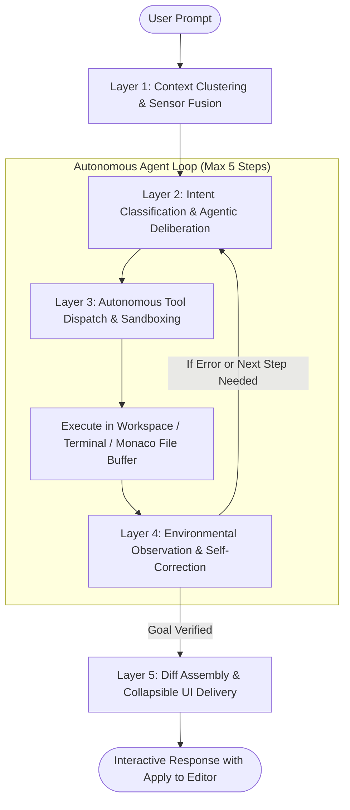

# VexP Code IDE - Autonomous AI Coding Harness

> A customizable, open-source AI coding harness and web IDE designed for local GPU inference (Ollama) and cloud APIs (OpenRouter, Claude, OpenAI, DeepSeek). Combines a full Monaco editor workspace with autonomous agent deliberation, in-prompt model switching, and real-time execution tools.

---

## Highlights

* **5-Layer Agentic Deliberation Loop**: Mirrored after Claude Code and Devin — automatically performs context clustering, intent planning, autonomous tool dispatch (`read_file_range`, `apply_file_diff`, `write_file`, shell commands), observation/self-correction, and final diff assembly.
* **In-Prompt Model Selector (Gemini / Cursor Style)**: Directly embedded in the chat input toolbar. Switch effortlessly between local GPU models and cloud models with an upward-floating popover.
* **Multi-Provider Architecture**:
  * **Ollama (Local)**: 100% private, offline, GPU-accelerated. Includes background VRAM preloading so model transitions never freeze.
  * **OpenRouter**: Access 100+ frontier models (Claude 3.5 Sonnet, DeepSeek V3/R1, Llama 3.3 70B, GPT-4o) with a single API key.
  * **Anthropic Claude (Direct)**: Native message API with dynamic tool schema translation.
  * **OpenAI & Compatible**: Configurable custom Base URL (supports DeepSeek API, Groq, Together AI, and local vLLM).
* **VS Code-Grade Desktop Feel**: Monaco editor with syntax highlighting, code folding, resizable draggable splitters, tabbed editing, and inline terminal.

---

## Architecture Overview



---

## File Structure

```
claude-code-ide/
├── backend/
│   ├── server.py              # FastAPI server & multi-provider agent harness
│   └── tools.py               # Workspace agent tools (read, write, diff, bash)
├── frontend/
│   └── index.html             # Monaco editor, responsive IDE layout, & dynamic UI
├── scripts/
│   ├── install.sh             # 1-click Linux/macOS setup script
│   └── start.sh               # 1-click launcher script
├── config/
│   └── default_config.json    # Default configuration & provider templates
├── requirements.txt           # Python dependencies
├── .env.example               # Optional environment variables
├── .gitignore                 # Standard repository ignores
└── README.md                  # Documentation and quickstart guide
```

---

## Quickstart (1-Click Setup)

### 1. Clone the repository
```bash
git clone https://github.com/your-username/claude-code-ide.git
cd claude-code-ide
```

### 2. Run the Installer
The installer creates a Python virtual environment, installs dependencies, and verifies your local Ollama installation:
```bash
./scripts/install.sh
```

### 3. Launch the IDE
```bash
./scripts/start.sh
```
Open your browser at:
```
http://127.0.0.1:7860
```

---

## Model & API Configuration

You can configure models directly inside the web UI:
1. Click the **Gear Icon** at the bottom of the Activity Bar, or click the model selector pill in the chat toolbar.
2. Under **AI Providers & Models**:
   * **Local Ollama**: Confirm endpoint (default: `http://127.0.0.1:11434`) and pull any model with 1 click.
   * **OpenRouter / Claude / OpenAI**: Toggle the switch, enter your API key, and click **Test Connection** to measure live ping latency in milliseconds.
3. Click **Save Settings** — newly configured models immediately appear in your in-prompt model switcher.

---

## Keyboard Shortcuts

| Shortcut | Action |
| :--- | :--- |
| `Ctrl + Enter` | Submit prompt to AI Assistant |
| `Ctrl + Shift + E` | Open Explorer view |
| `Ctrl + Shift + F` | Open Code Search view |
| `Ctrl + Shift + G` | Open Source Control view |
| `Ctrl + \`` | Toggle Integrated Terminal |
| `Ctrl + B` | Toggle Primary Sidebar |
| `Ctrl + ,` | Open IDE Settings & AI Providers |

---

## License

MIT License. Free for personal and commercial use.
